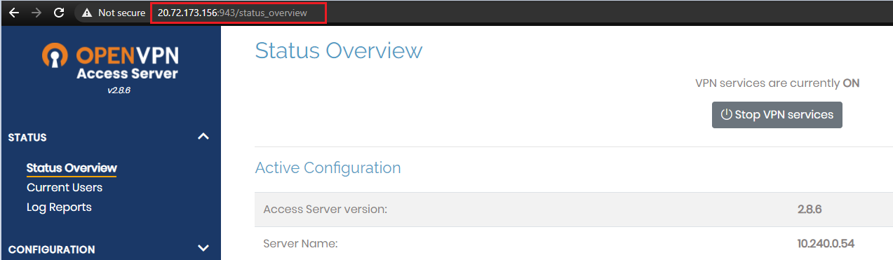
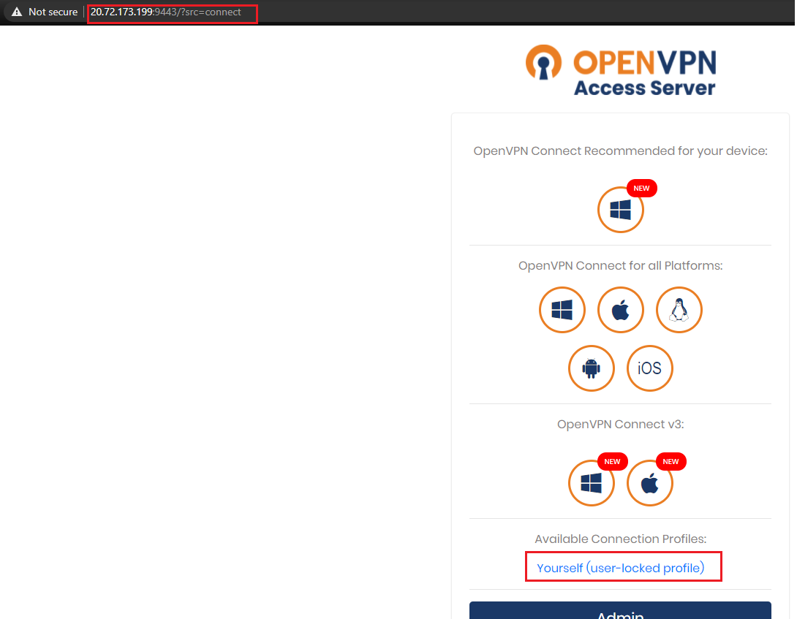
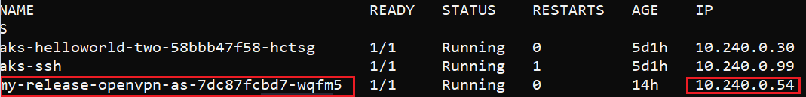

# OpenVPN on AKS

[TOC]

---

## Quick Intro

**What is OpenVPN?**

**OpenVPN** is a [virtual private network](https://en.wikipedia.org/wiki/Virtual_private_network) (VPN) system that implements techniques to create secure point-to-point or site-to-site connections in routed or bridged configurations and remote access facilities. It implements both [client and server](https://en.wikipedia.org/wiki/Client-server_architecture) applications.

OpenVPN allows [peers](https://en.wikipedia.org/wiki/Peer-to-peer) to [authenticate](https://en.wikipedia.org/wiki/Authentication) each other using [pre-shared secret keys](https://en.wikipedia.org/wiki/Pre-shared_key), [certificates](https://en.wikipedia.org/wiki/Public_key_certificate) or [username](https://en.wikipedia.org/wiki/User_(computing))/[password](https://en.wikipedia.org/wiki/Password). When used in a multiclient-server configuration, it allows the server to release an authentication certificate for every client, using [signatures](https://en.wikipedia.org/wiki/Digital_signature) and [certificate authority](https://en.wikipedia.org/wiki/Certificate_authority).

> Source: https://en.wikipedia.org/wiki/OpenVPN
>
> While we are at it, please contribute to Wikipedia, it is amazing, and deserves some support.

---

## Setup

The setup is in 3 parts:

1. Deploying an **OpenVPN Server** on a Pod in AKS
2. Accessing AKS Cluster's Pods via Private IP through VPN Tunnel from a Linux Machine
3. Accessing AKS Cluster's Pods via Private IP through  VPN Tunnel from a Pod in another cluster.

---

### Step 1: Setting OpenVPN Server

#### Pre-requisites

- AKS Cluster
- Helm v3 client installed on the local system

#### Steps

Connect to your AKS Cluster, and add the Helm Chart. For the sake of this simple lab, I will be using an existing Helm Chart available [here](https://artifacthub.io/packages/helm/stenic/openvpn-as).

##### Cluster resources before implementing chart

```bash
$ kubectl get pods
NAME                                  READY   STATUS    RESTARTS   AGE
aks-helloworld-two-58bbb47f58-hctsg   1/1     Running   0          4d10h
aks-ssh                               1/1     Running   1          4d10h

$ kubectl get svc
NAME                 TYPE        CLUSTER-IP     EXTERNAL-IP   PORT(S)   AGE
aks-helloworld-two   ClusterIP   10.0.224.176   <none>        80/TCP    4d10h
kubernetes           ClusterIP   10.0.0.1       <none>        443/TCP   49d
```

##### Installing Chart

```bash
$ helm repo add stenic https://stenic.github.io/helm-charts
"stenic" already exists with the same configuration, skipping

$ helm install my-release --set "service.type=LoadBalancer" --set "service.gui.type=LoadBalancer" --set "service.admin.type=LoadBalancer" stenic/openvpn-as
NAME: my-release
LAST DEPLOYED: Sat May  1 03:05:51 2021
NAMESPACE: default
STATUS: deployed
REVISION: 1
TEST SUITE: None
```

Chart is installed. For the sake of this lab, I have exposed the Admin URLs also through LoadBalancer Service, while the default would be ClusterIP. More configurations options are available [here](https://artifacthub.io/packages/helm/stenic/openvpn-as#configuration).

##### Verifying the installation

After the installation finishes:

```bash
$ kubectl get pods -o wide
NAME                                     READY   STATUS    RESTARTS      IP            
aks-helloworld-two-58bbb47f58-hctsg      1/1     Running   0             10.240.0.30   
aks-ssh                                  1/1     Running   1             10.240.0.99   
my-release-openvpn-as-7dc87fcbd7-wqfm5   1/1     Running   0             10.240.0.54   

$ kubectl get svc
NAME                          TYPE           CLUSTER-IP     EXTERNAL-IP     PORT(S) 
aks-helloworld-two            ClusterIP      10.0.224.176   <none>          80/TCP   
kubernetes                    ClusterIP      10.0.0.1       <none>          443/TCP 
my-release-openvpn-as-admin   LoadBalancer   10.0.97.146    20.72.173.156   943:30491/TCP 
my-release-openvpn-as-gui     LoadBalancer   10.0.118.238   20.72.173.219   944:31169/TCP 
my-release-openvpn-as-tcp     LoadBalancer   10.0.31.142    20.72.173.199   9443:30197/TCP
my-release-openvpn-as-udp     LoadBalancer   10.0.111.157   20.72.173.74    1194:32266/UDP   
```

> NOTE: Make sure that you have allowed the above Ports in the Security Group for Subnet and VMSS.

The Chart is installed, and the Services are up.

Make a note of the `External-IP` of the Services for both, TCP and UDP.

Also, here, we will be trying to access the Pod `aks-helloworld-two` with IP `10.240.0.30` from an external network using the Pod IP itself.

Just for understanding, I get a TimedOut error when I try to access the Pod IP without connecting the VPN Client from my Linux VM:

```bash
root@TheMachine:/home/azureuser# curl http://10.240.0.30/ -I
curl: (7) Failed to connect to 10.240.0.30 port 80: Connection timed out
```

##### Accessing the OpenVPN Server

Now that the OpenVPN Services are up, let us access them:

- Admin Portal:

  

- VPN Server:

  

These URLs will prompt you for Username and Password, which I have used the default ones.

The OpenVPN Server is Up and Running!

---

### Step 2: Accessing OpenVPN Server and Pods in it's local network from a **Linux VM**

#### What we need

- OpenVPN Client installed on the Linux VM
- Configuration Profile for the client to use

#### Steps

As highlighted above, you can download the Profile for connecting to Server.

On fetching the Profile, it looks like this:

```yaml
setenv FORWARD_COMPATIBLE 1
client
server-poll-timeout 4
nobind
remote 10.240.0.54 1194 udp
remote 10.240.0.54 1194 udp
remote 10.240.0.54 9443 tcp
remote 10.240.0.54 1194 udp
remote 10.240.0.54 1194 udp
remote 10.240.0.54 1194 udp
remote 10.240.0.54 1194 udp
remote 10.240.0.54 1194 udp
dev tun
dev-type tun
ns-cert-type server
setenv opt tls-version-min 1.0 or-highest
reneg-sec 604800
sndbuf 0
rcvbuf 0
auth-user-pass
# NOTE: LZO commands are pushed by the Access Server at connect time.
# NOTE: The below line doesn't disable LZO.
comp-lzo no
verb 3
setenv PUSH_PEER_INFO
## Then it has the CA, CRT and KEY file.
```

The `remote` is pointed to the Private IP of the OpenVPN Server Pod's IP:



... we will change the Profile file to point to the Service's Load Balancer IP, instead of the Pod's IP, so that we can access it from outside the Cluster:

```yaml
setenv FORWARD_COMPATIBLE 1
client
server-poll-timeout 4
nobind
remote 20.72.173.74 1194 udp
remote 20.72.173.74 1194 udp
remote 20.72.173.199 9443 tcp
remote 20.72.173.74 1194 udp
remote 20.72.173.74 1194 udp
remote 20.72.173.74 1194 udp
remote 20.72.173.74 1194 udp
remote 20.72.173.74 1194 udp
dev tun
dev-type tun
ns-cert-type server
setenv opt tls-version-min 1.0 or-highest
reneg-sec 604800
sndbuf 0
rcvbuf 0
auth-user-pass
# NOTE: LZO commands are pushed by the Access Server at connect time.
# NOTE: The below line doesn't disable LZO.
comp-lzo no
verb 3
setenv PUSH_PEER_INFO
```

I already have an Ubuntu 18.04 VM ready with current IP `20.193.155.28`. First, I will copy the Configuration Profile to this VM, and then install OpenVPN Client.

> Note: I could have used my local Windows Machine as the VPN Client, but since it is associated with my company network, there are additional proxy and hops involved. For simplicity, I felt better in using a Linux VM for the lab.

##### Copying profile to Linux VM using SCP

From my Windows machine:

```powershell
$ scp -i .\TheMachine_key.pem client.ovpn azureuser@20.193.155.28:/home/azureuser/
client.ovpn                                                                                         100% 9923   108.7KB/s   00:00
```

Since I am using Key based authentication for accessing my Linux VM, the format for scp command is:

```bash
$ scp -i <path-to-key> <source-file-location> vm-user@<vm-ip>:<location-to-copy-file>
```

I see the file on my Linux machine:

```bash
$ root@TheMachine:/home/azureuser# ls
client.ovpn
```

##### Installing openvpn client

```bash
$ root@TheMachine:/home/azureuser# apt-get install openvpn
```

##### Connecting to the OpenVPN Server using the configuration profile

```bash
$ root@TheMachine:/home/azureuser# openvpn --config client.ovpn
Sat May  1 13:30:55 2021 OpenVPN 2.4.4 x86_64-pc-linux-gnu [SSL (OpenSSL)] [LZO] [LZ4] [EPOLL] [PKCS11] [MH/PKTINFO] [AEAD] built on May 14 2019
Sat May  1 13:30:55 2021 library versions: OpenSSL 1.1.1  11 Sep 2018, LZO 2.08

## Enter the User and Password at prompt
Enter Auth Username: altmin
Enter Auth Password: ********

...
...
...
Sat May  1 13:31:10 2021 /sbin/ip route add 20.72.173.74/32 via 10.50.0.1
Sat May  1 13:31:10 2021 /sbin/ip route add 172.27.224.0/20 metric 101 via 172.27.232.1
Sat May  1 13:31:10 2021 /sbin/ip route add 10.240.0.0/16 metric 101 via 172.27.232.1
Sat May  1 13:31:10 2021 Initialization Sequence Completed
```

Connection is established, now from another session in the VM, we can try and connect to one of the Pod in cluster using it's Pod IP. Remember that we tried this earlier and it resulted in time out.

##### Testing Connectivity

```bash
$ root@TheMachine:/home/azureuser# curl http://10.240.0.30 -I
HTTP/1.1 200 OK
Server: nginx/1.13.7
Date: Sat, 01 May 2021 13:33:57 GMT
Content-Type: text/html; charset=utf-8
Content-Length: 579
Connection: keep-alive
```

Great, so the setup works. We are able to access the Server Network from a VPN Client. This is a **point-to-site** VPN configuration.

When I see the Application Pod's access logs, the traffic comes from the POD IP of OpenVPN Server (10.240.0.5). This is because the default routing from OpenVPN Client to resources in the Server's Network is through NAT:

```bash
$ k logs aks-helloworld-two-58bbb47f58-hctsg --tail=10
[pid: 15|app: 0|req: 10/10] 10.240.0.54 () {32 vars in 333 bytes} [Sat May  1 13:39:35 2021] HEAD / => generated 0 bytes in 0 msecs (HTTP/1.1 200) 2 headers in 80 bytes (0 switches on core 0)
10.240.0.54 - - [01/May/2021:13:39:35 +0000] "HEAD / HTTP/1.1" 200 0 "-" "curl/7.58.0" "-"
[pid: 15|app: 0|req: 11/11] 10.240.0.54 () {32 vars in 333 bytes} [Sat May  1 13:40:52 2021] HEAD / => generated 0 bytes in 1 msecs (HTTP/1.1 200) 2 headers in 80 bytes (0 switches on core 0)
10.240.0.54 - - [01/May/2021:13:40:52 +0000] "HEAD / HTTP/1.1" 200 0 "-" "curl/7.58.0" "-"
[pid: 14|app: 0|req: 1/12] 10.240.0.54 () {32 vars in 333 bytes} [Sat May  1 13:40:54 2021] HEAD / => generated 0 bytes in 15 msecs (HTTP/1.1 200) 2 headers in 80 bytes (0 switches on core 0)
10.240.0.54 - - [01/May/2021:13:40:54 +0000] "HEAD / HTTP/1.1" 200 0 "-" "curl/7.58.0" "-"
[pid: 15|app: 0|req: 12/13] 10.240.0.54 () {32 vars in 333 bytes} [Sat May  1 13:40:55 2021] HEAD / => generated 0 bytes in 0 msecs (HTTP/1.1 200) 2 headers in 80 bytes (0 switches on core 0)
10.240.0.54 - - [01/May/2021:13:40:55 +0000] "HEAD / HTTP/1.1" 200 0 "-" "curl/7.58.0" "-"
[pid: 15|app: 0|req: 13/14] 10.240.0.54 () {32 vars in 333 bytes} [Sat May  1 13:40:56 2021] HEAD / => generated 0 bytes in 0 msecs (HTTP/1.1 200) 2 headers in 80 bytes (0 switches on core 0)
10.240.0.54 - - [01/May/2021:13:40:56 +0000] "HEAD / HTTP/1.1" 200 0 "-" "curl/7.58.0" "-"
```

More details on Routing and NAT: https://openvpn.net/vpn-server-resources/reach-openvpn-clients-directly-from-a-private-network/

> It should be noted that my Linux VM's IP is in the range 10.50.x.x, which does not overlap with any of the CIDRs used for my AKS Cluster. There is an ability in OpenVPN to enable traffic from overlapping CIDRs. More details here: https://openvpn.net/cloud-docs/remote-access-private-networks-overlapping-ip-address/

---

### Step 3: Accessing OpenVPN Server and Pods in it's local network from a **Pod in another Cluster**


#### What we need?

- A Pod with OpenVPN Client
- Configuration Profile for the Client to use

#### Steps

##### Creating a Pod:

Let us create a Pod in a new Cluster:

```bash
$ cat pod.yaml

apiVersion: v1
kind: Pod
metadata:
  creationTimestamp: null
  labels:
    run: openvpn-client
  name: openvpn-client
spec:
  containers:
  - image: debian
    name: openvpn-client
    command:
      - sleep
      - "36000"
    securityContext:
      capabilities:
        add: ["NET_ADMIN"]
    resources: {}
  dnsPolicy: ClusterFirst
  restartPolicy: Always
  
$ kubectl create -f pod.yaml
pod/openvpn-client created
```

###### Why `NET_ADMIN` capability is required by the Pod?

If you launch containers without ability to sniff packets, the OpenVPN Client will through following error when you try to connect to the OpenVPN Server:

```yaml
ERROR: Cannot ioctl TUNSETIFF tun: Operation not permitted (errno=1)
```

##### Installing additional packages in the Pod:

Exec into Pod:

```bash
$ kubectl get pods
NAME             READY   STATUS    RESTARTS   AGE
aks-ssh          1/1     Running   1          2d12h
openvpn-client   1/1     Running   0          65s

$ kubectl exec -it openvpn-client -- bash
root@openvpn-client:/#
```

Install curl and openvpn in the Pod:

```bash
root@openvpn-client:/# apt-get update -y && apt-get install curl -y && apt-get install openvpn -y
```

##### Copying Profile config to the Client Pod:

From my local windows machine, where I initially downloaded and modified the OVPN Client Configuration file:

```bash
$ kubectl cp client.ovpn openvpn-client:/tmp/
```

I can see the file in my client Pod:

```bash
root@openvpn-client:/# cd /tmp
root@openvpn-client:/tmp# ls
client.ovpn
```

##### Connecting to the VPN Server (error):

```bash
root@openvpn-client:/tmp# openvpn --config client.ovpn

Mon May  3 10:12:15 2021 OpenVPN 2.4.7 x86_64-pc-linux-gnu [SSL (OpenSSL)] [LZO] [LZ4] [EPOLL] [PKCS11] [MH/PKTINFO] [AEAD] built on Feb 20 2019
Mon May  3 10:12:15 2021 library versions: OpenSSL 1.1.1d  10 Sep 2019, LZO 2.10

Enter Auth Username:altmin
Enter Auth Password:

...
...
Mon May  3 10:12:23 2021 [OpenVPN Server] Peer Connection Initiated with [AF_INET]20.72.173.74:1194
...
...

Mon May  3 10:12:24 2021 ERROR: Cannot open TUN/TAP dev /dev/net/tun: No such file or directory (errno=2)
Mon May  3 10:12:24 2021 Exiting due to fatal error
```

I get an error while initiating the connection to the OpenVPN Server. This is expected as the default ```debian``` image does not contain some of the configurations required for OpenVPN Client.

##### Adding requirements to the Client Pod:

```bash
root@openvpn-client:/tmp# mkdir -p /dev/net
root@openvpn-client:/tmp# mknod /dev/net/tun c 10 200
root@openvpn-client:/tmp# chmod 600 /dev/net/tun
root@openvpn-client:/tmp# cat /dev/net/tun
```

##### Connecting to the VPN Server (success):

```bash
root@openvpn-client:/tmp# openvpn --config client.ovpn

...
...

Enter Auth Username:altmin
Enter Auth Password:
...
...
Mon May  3 10:29:48 2021 /sbin/ip route add 172.27.224.0/20 metric 101 via 172.27.232.1
Mon May  3 10:29:48 2021 /sbin/ip route add 10.240.0.0/16 metric 101 via 172.27.232.1
Mon May  3 10:29:48 2021 Initialization Sequence Completed
```

Connected!

##### Testing connectivity:

Now that the client is connected to the Server, let us try to access one of the Pod in the Server's Network from the Client Pod.

From a new Shell in the Client Pod:

```bash
$ kubectl exec -it openvpn-client -- bash

root@openvpn-client:/# curl http://10.240.0.30/ -I
HTTP/1.1 200 OK
Server: nginx/1.13.7
Date: Mon, 03 May 2021 10:37:49 GMT
Content-Type: text/html; charset=utf-8
Content-Length: 579
Connection: keep-alive
```

```bash
## Client Cluster Pods:
$ kubectl get pods -o wide
NAME             READY   STATUS    RESTARTS   AGE     IP                                     
aks-ssh          1/1     Running   1          2d13h   10.1.0.89    
openvpn-client   1/1     Running   0          13m     10.1.0.101

## Switching to Server Cluster:
$ az aks get-credentials -n aks-cluster -g aks-rg
Merged "aks-cluster" as current context in C:\Users\rissing\.kube\config

## Server Cluster Pods:
$ kubectl get pods -o wide
NAME                                     READY   STATUS    RESTARTS   AGE     IP            
aks-helloworld-two-58bbb47f58-hctsg      1/1     Running   0          6d23h   10.240.0.30   
aks-ssh                                  1/1     Running   1          6d23h   10.240.0.99   
my-release-openvpn-as-7dc87fcbd7-wqfm5   1/1     Running   0          2d13h   10.240.0.54   
```

My Client Pod is from the address 10.1.0.0/24 and the Pod which I was accessing above, is in another cluster, and has Private IP 10.240.0.30.  I was still able to connect to the destination Pod using it's Private IP, and this proves that the <b>point-to-site</b> VPN connectivity is working fine.

This concludes the labs. These are very simple examples and there is much more you can do with OpenVPN. When speaking about OpenVPN in Kubernetes, there are certain limitations as well.

---

### Use Case for my client:

1. Since the end users were located at different sites geographically, providing dynamic private access to each client was a challenge. Every time a new client location wanted to access the AKS Cluster resources, a new point-to-site VPN had to be established.

   OpenVPN gives a fast way to do it.

2. Although not the best use case for OpenVPN, the Admin Portal provides access logs through the VPN Server. You can monitor which client accessed which resource and can perform some basic filtering on it.

3. Customer wanted to have the client and the server as part of the same AKS Cluster. This would mean they wanted to over-ride the default Pod-to-Pod connectivity and rather have traffic flow through the VPN Server. This is not possible in Kubernetes, as the VPN Server in this case would require *Layer 2 Ethernet Bridging Mode* which is not supported (I think). Moreover, if a customer modifies the default routing behavior for AKS Networking, it will not be supported. AKS being a managed offering, it's routing should not be modified manually/using 3rd party tools.

   Details: https://openvpn.net/vpn-server-resources/configuring-openvpn-access-server-for-a-privately-bridged-network/#prerequisites

For #2 and #3 above, I suggested client to use:

- Prometheus/Azure Monitors/etc to monitor Pod-to-Pod traffic

- Use SideCar Proxy like Istio/Linkerd for having secure Pod-to-Pod connectivity using mTLS.

  https://linkerd.io/2.10/features/automatic-mtls/

For #2 and #3 above, OpenVPN is not the best solution.

---

### Footnotes:

You can install another OpenVPN Server implementation instead of using the one used here. Or, you can build your own Docker Image. One of the solution is here, have not tried: https://bugraoz93.medium.com/openvpn-client-in-a-pod-kubernetes-d3345c66b014